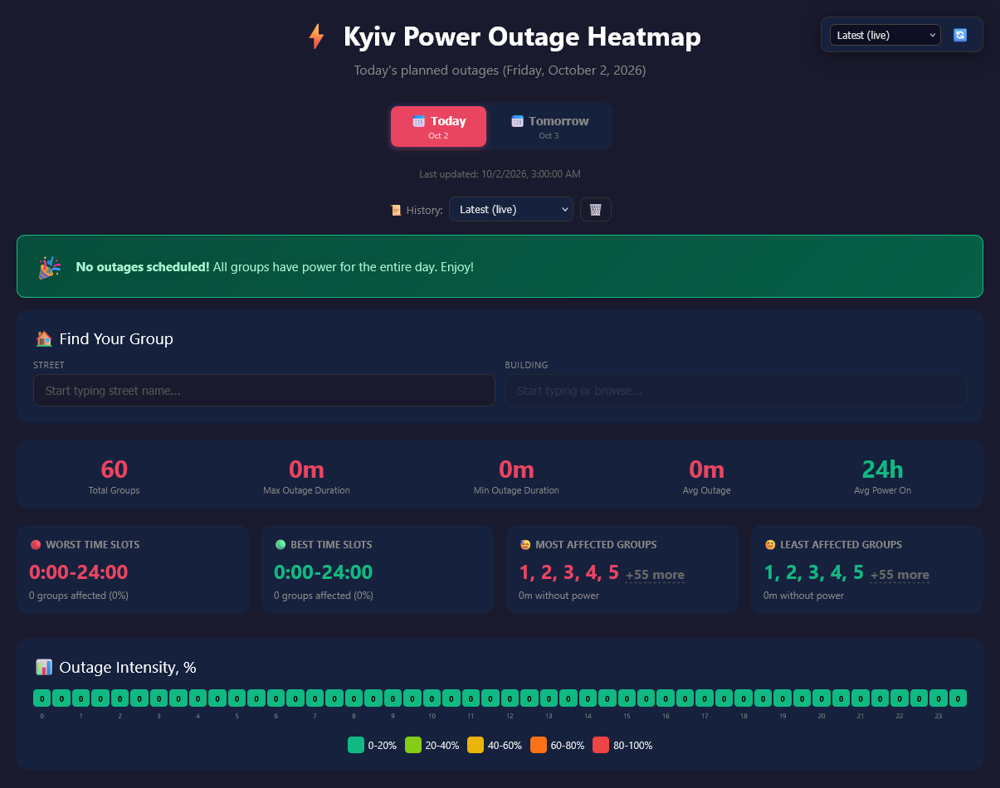
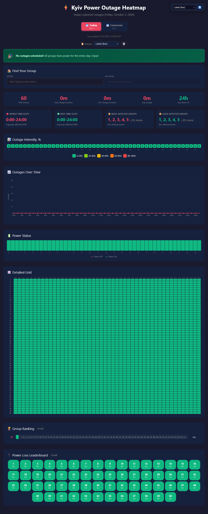
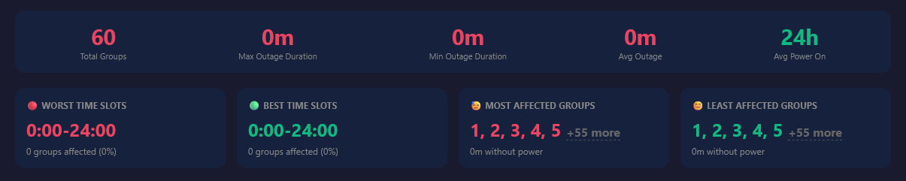
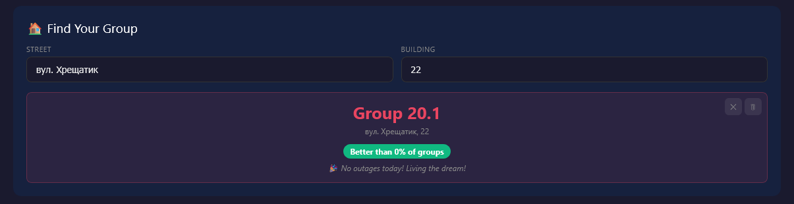
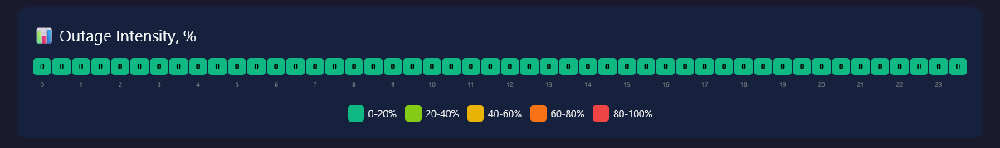
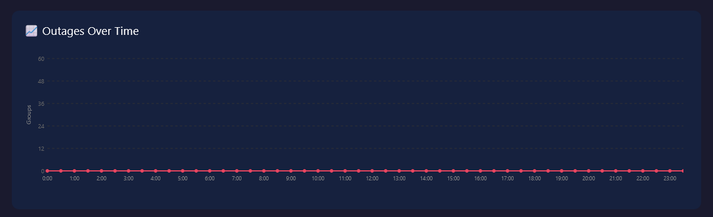
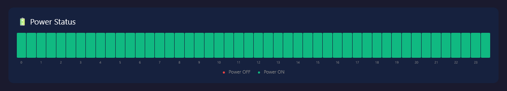
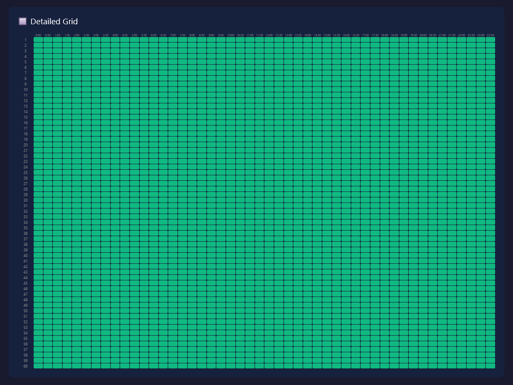
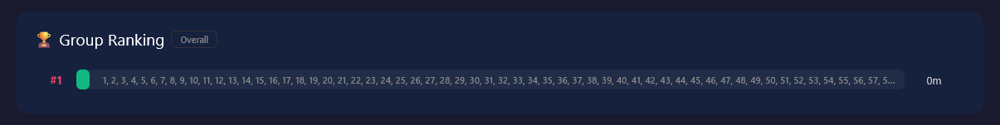
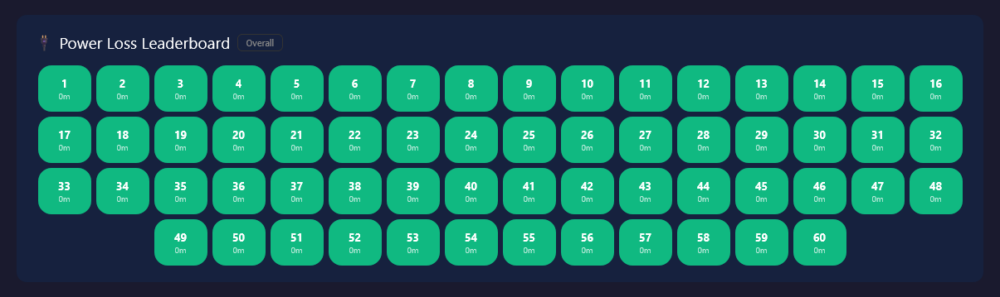

# Kyiv Power Outage Heatmap

A web dashboard that visualizes Yasno scheduled power outages across Kyiv. It fetches live data from the Yasno API, presents it through multiple interactive visualizations, and keeps a local history so you can track how schedules change over time.

## Dashboard Overview

  

View the full dashboard

<em>These captures show a no-outages schedule; the dashboard reflects live Yasno data.</em>

## Sections

### Summary Bar

A top-level overview showing total groups, max/min/average outage duration, and average power-on time for the selected day.

### Find Your Group

Address lookup by street and building number. Once you find your outage group, it's saved to local storage so you see your schedule immediately on future visits. Shows your group number, outage windows, and a percentile ranking compared to other groups.

### Outage Intensity Heatmap

A color-coded 48-slot grid (one slot per 30 minutes) showing what percentage of groups are without power at each time of day. Ranges from green (0-20%) to red (80-100%). On mobile, the grid splits into two rows for readability.

### Outages Over Time

An SVG area chart plotting the number of affected groups across the day. Hover or tap on data points to see exact group counts per time slot.

### Power Status

A stacked bar chart showing the ON/OFF split for every 30-minute slot. Gives a quick visual of how much of the city has power at any given moment.

### Detailed Grid

A per-group, per-slot matrix where each row is an outage group and each column is a 30-minute slot. Red cells mean power off, green means power on. On screens up to 853px wide, the overview fits the screen; tap a group to expand its schedule into two half-day strips.

### Group Ranking

Horizontal bar chart ranking all groups by total outage duration. Groups with the most downtime appear at the top. Supports an "Overall" toggle that aggregates across all stored history days.

### Power Loss Leaderboard

A compact chip-based view of the same ranking data, showing each group's outage duration at a glance. Also supports the overall/today toggle.

## History & Snapshots

Each time the page loads fresh data, a snapshot is automatically stored in the browser's local storage (up to 4 snapshots per day, 30 days max). A history selector in the toolbar lets you browse past snapshots to see how the schedule looked at different times. The "Overall" mode in ranking sections aggregates outage minutes across all stored days.

## Data Source

Schedule data is fetched live from the [Yasno API](https://yasno.com.ua) via CORS proxies (with a fallback chain). The dashboard also handles special states like emergency shutdowns and no-outage days with dedicated status banners.

## Usage

Open `index.html` in a browser. No build tools, no dependencies, no server required — it's a single self-contained HTML file.

## GitHub Pages Deployment

The repository workflow publishes the static pages when changes are pushed to `master`. In repository settings, set **Pages > Build and deployment > Source** to **GitHub Actions**. Add a rotated corsproxy.dev key as the `CORSPROXY_KEY` Actions secret under **Secrets and variables > Actions**. The workflow injects it into the published HTML; local source keeps the key empty and falls back to the public proxies.

The key is still visible in the deployed page and browser requests. Keep its corsproxy.dev restrictions limited to this site's origin and the Yasno API host/path.
